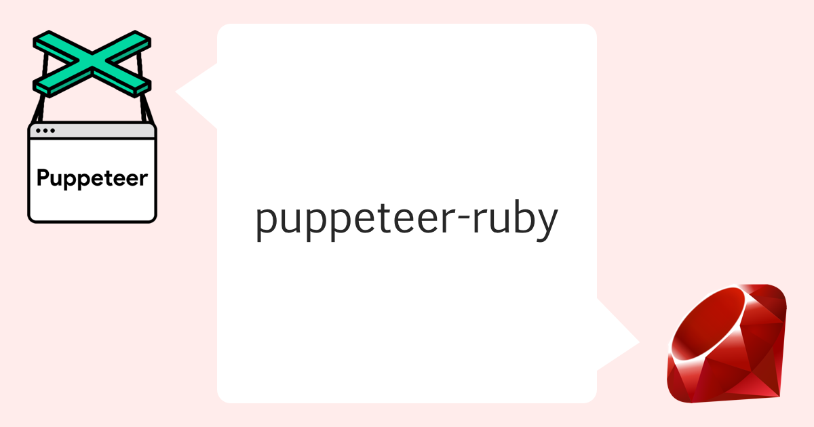

# Puppeteer in Ruby [UNDER HEAVY DEVELOPMENT]

A Ruby port of [puppeteer](https://pptr.dev/).



REMARK: This Gem is NOT production-ready!!

## Getting Started

### Capture a site

```ruby
Puppeteer.launch(headless: false) do |browser|
  page = browser.pages.first || browser.new_page
  page.goto("https://github.com/YusukeIwaki")
  page.screenshot(path: "YusukeIwaki.png")
end
```

### Simple scraping

```ruby
require 'puppeteer'

Puppeteer.launch(headless: false, slow_mo: 50, args: ['--guest', '--window-size=1280,800']) do |browser|
  page = browser.pages.first || browser.new_page
  page.viewport = Puppeteer::Viewport.new(width: 1280, height: 800)
  page.goto("https://github.com/", wait_until: 'domcontentloaded')

  form = page.S("form.js-site-search-form")
  searchInput = form.S("input.header-search-input")
  searchInput.type_text("puppeteer")
  await_all(
    page.async_wait_for_navigation,
    searchInput.async_press("Enter"),
  )

  list = page.S("ul.repo-list")
  items = list.SS("div.f4")
  items.each do |item|
    title = item.Seval("a", "a => a.innerText")
    puts("==> #{title}")
  end
end
```

More usage examples can be found [here](https://github.com/YusukeIwaki/puppeteer-ruby-example)

## API

https://yusukeiwaki.github.io/puppeteer-ruby-docs/

## Contributing

Bug reports and pull requests are welcome on GitHub at https://github.com/YusukeIwaki/puppeteer-ruby.
